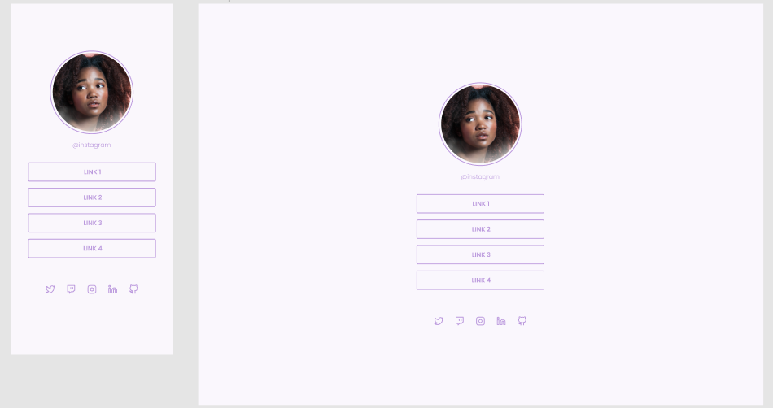

<h1 align="center"> ⌨️ Social Tree. </h1>

	

## 💻 Sobre o projeto

O próposito desse estudo era criar uma **Site Responsivo** utilizando HTML, CSS e JS. Este projeto se enquadra na minha sessão pessoal, onde estou praticando front-end com bootstrap 5 para lembrar e reforçar os meus conhecimentos.
Social Tree. é uma página simples no formato de página unica com links de acesso a redes sociais e sites e ela é responsiva. 

---

## 🛠 Tecnologias e ferramentas utilizadas:

As seguintes ferramentas foram usadas na construção do projeto:

## 🖥️ Demonstração

   

- Você pode acessar o projeto clicando <a href="https://fabricio-roca.github.io/beautysalon.web/">aqui</a>.

---

## 🧠 Créditos

- Agradeço ao Rockyseat pelo modelo de desafio deste projeto e a maneira, consegui configurar o site da maneira que eles haviam explicado e colocando da maneira que eu queria.

---

### Requisitos

> Requisitos para aplicação

- NodeJs: v16.5.* ou v16^
- Bootstrap: v5.0.2
- Ejs
- Express
- Sass

### 📝 Bibliotecas

- [Google Fonts](https://fonts.google.com/)
- [bootstrap](https://getbootstrap.com/)
- [Ejs](https://ejs.co/)
- [express](https://expressjs.com/pt-br/)
- [sass](https://sass-lang.com/)

<!-- ### 📝 Utilitários

- [randomuser.me](https://randomuser.me/photos)
- [IconMoon](https://icomoon.io/app/#/select) -->

---

### Instalação

- Clone o repositorio.
- Compilar servidor com o comando: `make build`.
- Levantar servidor com o comando: `make up`.
- Acessar o servidor em: `http://localhost:8080`.

### Instalação resumida

- Clone o repositorio.
- Executar o comando para compilar e levantar o servidor: `make run`.
- Acessar o servidor em: `http://localhost:8080`.

---

### Regra de compilação dos assets.

- Compilar o sass com o comando: `make scssToCss`.
  - **Observação:** Este comando irá compilar o sass e mover o arquivo para a pasta `public/css`.
  - **Atenção:** Execute este comando sempre que for alterar o arquivo `style.scss` ou qualquer outro arquivo `.scss` que esteja dentro da pasta `src/public/scss` e programado no arquivo `scssToCss.js`.

<h5 align="center">
  Criado com 💙 por <a href="https://github.com/alvesnelio">Nélio Souza Alves</a>
</h5>
